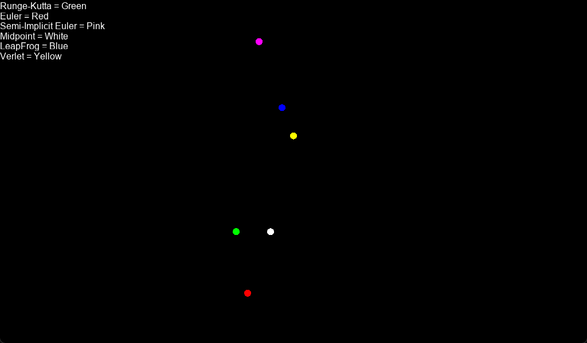

# cpp-physics-method
please install [raincloud](https://github.com/scenent/raincloud) library to compile.

## features
- Runge-Kutta Method
- Euler Method
- Semi-Implicit Euler Method
- Midpoint Method
- Leapfrog Method
- Verlet Method

## screenshot

